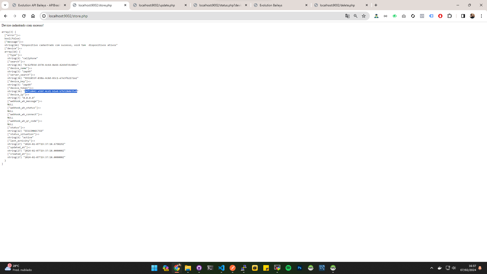
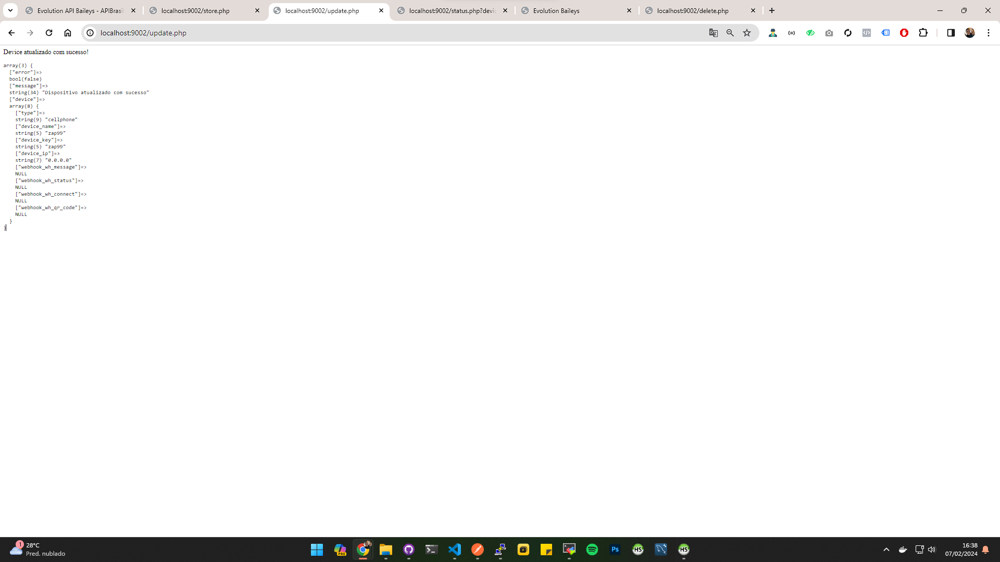
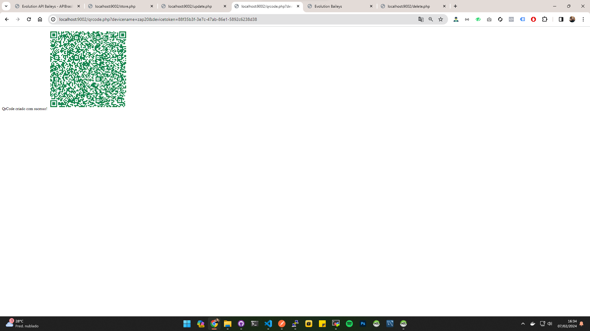
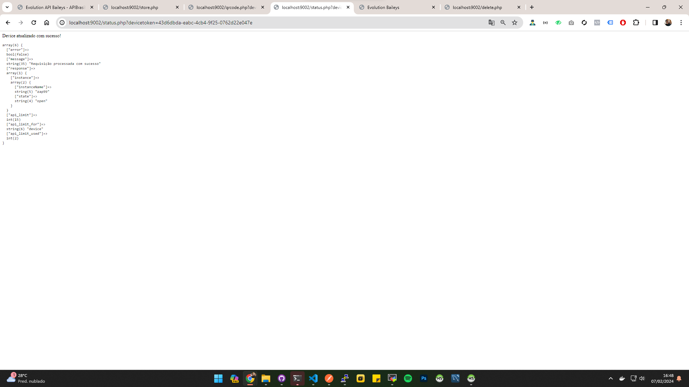
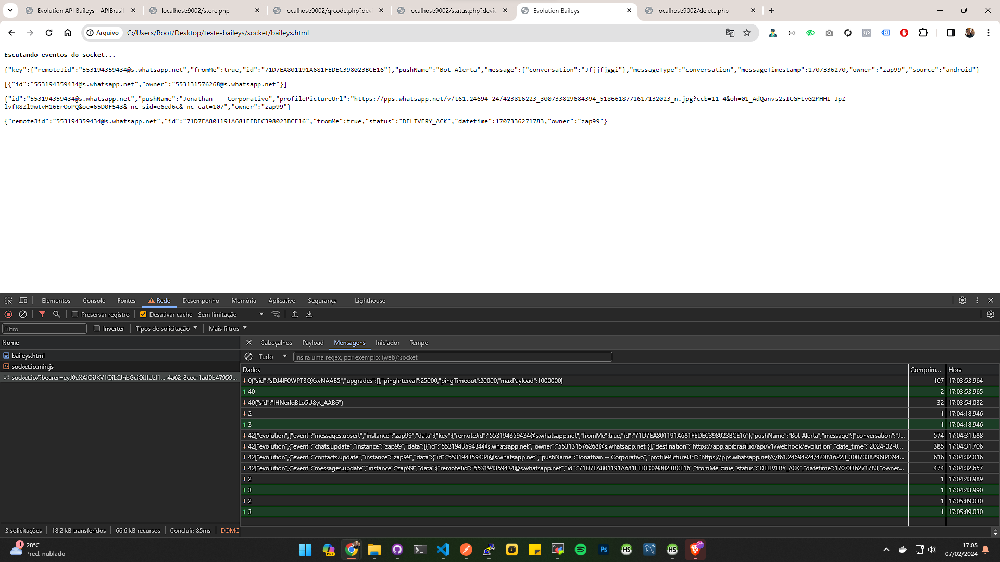

# Como consumir API Evolution Baileys utilizando APIBRASIL
Vamos ver nesses exemplos abaixo, como é fácil consumir as funcionalidades da API Evolution Baileys utilizando a APIBRASIL, você pode copiar e utilizar esse código em seus softwares comerciais. 

# Criar um dispositivo
Para que você possa utilizar as API's da plataforma, você deve cadastrar previamente o dispositivo na plataforma

### Exemplo de código

```php
$store = requestDefault('devices/store', [
    "SecretKey" => "06b8f746-b268-4234-a0b6-5c88a84caa47", // sua secret key /api/v2/apis
    "body" => [
        "server_search" => "9951855f-030a-4c8d-83c1-e7e3fb2172a2", // Obtenha o serversearch /api/v2/servers 
        "type" => "cellphone", // Tipos cellphone/tablet
        "device_name" => "zap99", // Defina um nome para o device
        "device_key"=> "zap99", // Defina um device key
        "device_ip" => "0.0.0.0", // IP de origem da requisição
        "webhook_wh_message" => "", // Webhook de mensagens
        "webhook_wh_status" => "" // Webhook de status
    ]
]);
```

```bash
php -S http://localhost:9002 ./instance/store.php
```
### Url de acesso

http://localhost:9002/store.php



---

# Atualizando o dispositivo
Basta você informar os parametros que deseja atualizar, os parametros permitidos são:
```
{
    "search": "82faab0a-24f4-4b8b-9926-455ea9b3cdb7",
    "server_search": "a2c85262-f830-4b90-a8da-ff67b7a7ed6e",
    "type": "cellphone",
    "device_name" : "zap2",
    "device_key": "zapzap1",
    "device_ip": "198.29.10.50",
    "webhook_wh_message":"",
    "webhook_wh_status":""
}
```

### Exemplo de código
```php
$update = requestDefault('devices/search', [
    "body" => [
        "search" => "3472d042-e56f-4cd1-b1e6-b7b320db35a9", // obtenha o devicetoken /api/v2/devices
        "device_ip" => "0.0.0.0",
        "server_search" => "9951855f-030a-4c8d-83c1-e7e3fb2172a2", // obtenha o serversearch /api/v2/servers
    ]
]);
```

```bash
php -S http://localhost:9002 ./instance/update.php
```

http://localhost:9002/update.php



---

# Obter o qrcode da instância
Você deve ter em mãos o devicename e o devicetoken para iniciar uma instância e obter o qrcode

### Exemplo de código 
```php

// usa a request padrão para criar o qrcode
$create = requestDefault('evolution/instance/create', [
    "DeviceToken" => $devicetoken,
    "body" => [
        "instanceName" => $devicename, //deve ter o mesmo nome do device
        "qrcode" => true,
    ]
]);
```

```bash
php -S http://localhost:9002 ./instance/qrcode.php
```

http://localhost:9002/qrcode.php?devicename=zap01&devicetoken=ca608669-e078-4c33-94bb-055bc6aa2a46



# Status da conexão com a instância
Tenha em mãos o devicetoken para obter o status da instância se ela estiver OPEN está conectado corretamente.

### Exemplo de código
```php

// usa a request padrão para criar o qrcode
$status = requestDefault('evolution/instance/connectionState', [
    "DeviceToken" => $devicetoken,
    "method" => "GET",
]);
```

```bash
php -S http://localhost:9002 ./instance/status.php
```

http://localhost:9002/status.php?devicetoken=43d6dbda-eabc-4cb4-9f25-0762d22e047e




# Escutando socket e seus eventos
Com o nosso poderoso servidor socket, é possível escutar todos os eventos do seu dispositivo conectado.


### Exemplo de código

```js
const socket = io('https://socket.apibrasil.com.br', {
    query: {
        "bearer": '...vwT4CM5BTl8_OmnKw8dIxi3qe1WPKcfTL3x6KhcwVaY', // seu BearerToken
        "channelName": '....1ad0b479599e' //seu profileID
    },
    transports: ['websocket']
});

//socket success
socket.on('connect', () => {
    console.log('Conectado ao socket');
});

// socket listen event for evolution
socket.on('evolution', (evolution) => {

    console.log(evolution);

    const container = document.getElementById('evolution');
    const response = JSON.stringify(evolution?.data);

    let p = document.createElement('p');
    p.innerHTML = response;
    container.appendChild(p);

});
```

./teste-baileys/socket/baileys.html

